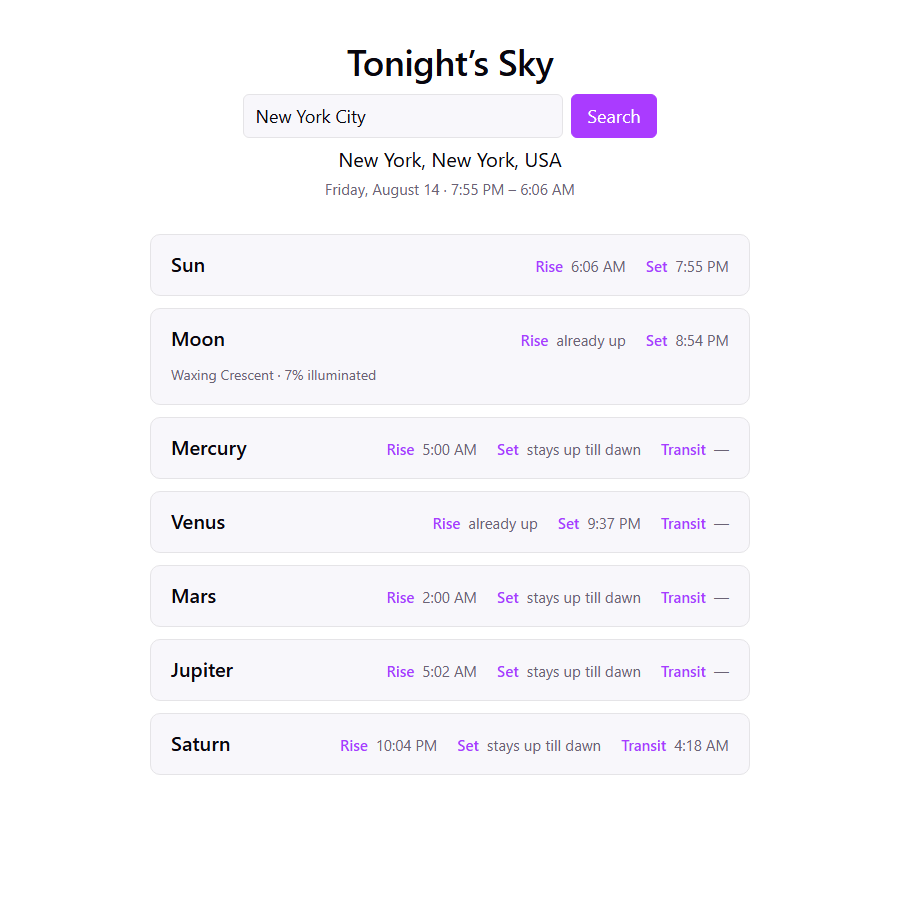

# astro.phase

A personal, portfolio-quality web app that shows what's visible in the night sky
tonight, for any place you type in.

Search a location and see tonight's window (sunset to sunrise) laid out for the
Sun, Moon, and the five naked-eye planets — rise, set, and (for planets) transit
times, the Moon's phase and illumination, and an explicit "not up tonight" state
for anything that never clears the horizon. Everything is shown in the searched
location's own local time, not your browser's.

**Live demo:** https://tagboy9803.github.io/astro.phase/



## How it works

- **Astronomy**: [`astronomy-engine`](https://github.com/cosinekitty/astronomy) computes
  rise/set/transit times, Moon phase, and illumination from pure geometry (a body
  counts as "up" once it's above 0° altitude — no weather, light pollution, or
  equipment modeling).
- **Geocoding**: place names are resolved to coordinates via the
  [LocationIQ](https://locationiq.com/) Search API. Ambiguous names show a list of
  candidates to pick from instead of guessing.
- **Timezones**: the searched location's IANA timezone is looked up offline with
  [`@photostructure/tz-lookup`](https://github.com/photostructure/tz-lookup) and used
  to format every timestamp with `Intl.DateTimeFormat`, so times are always local to
  the place you searched, not to whoever's viewing the page.

Everything runs client-side — there's no backend or server-side code.

## Stack

TypeScript, Vite, React.

## Setup

```bash
npm install
```

Copy `.env.local.example` to `.env.local` and fill in a
[LocationIQ](https://locationiq.com/) API key (the free tier is enough):

```bash
cp .env.local.example .env.local
```

## Run

```bash
npm run dev
```

## Build

```bash
npm run build
```

## Deploy

Pushing to `main` builds the app and publishes it to GitHub Pages via
[`.github/workflows/deploy.yml`](.github/workflows/deploy.yml). The workflow needs a
repository secret named `VITE_LOCATIONIQ_API_KEY` (Settings → Secrets and variables →
Actions) — it's not committed anywhere, since it authorizes API usage.
